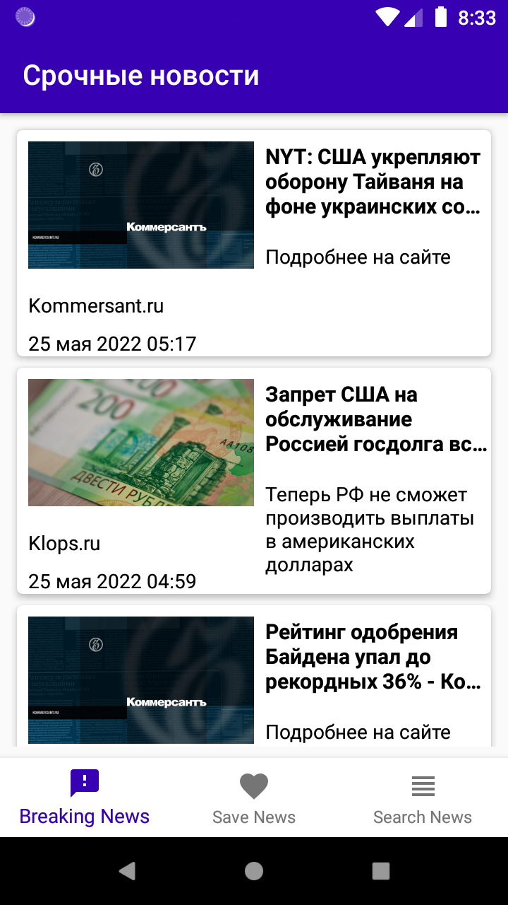
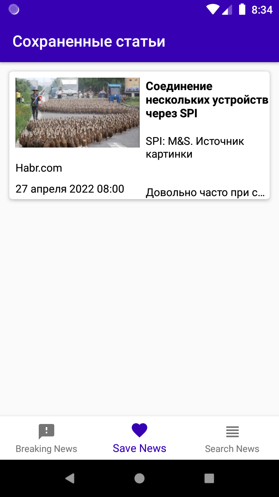
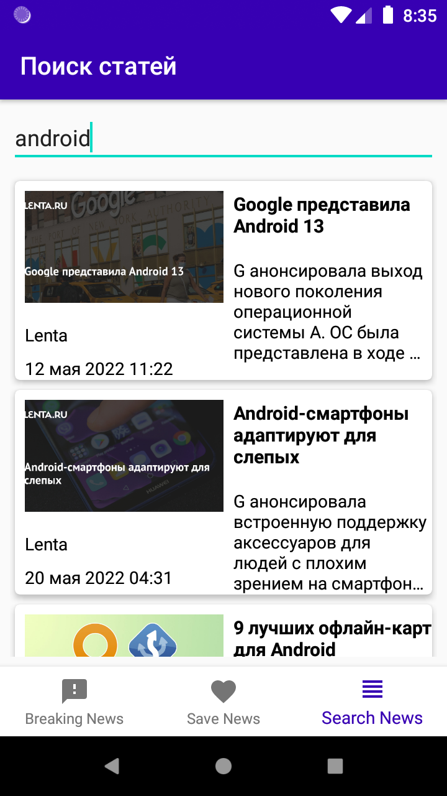
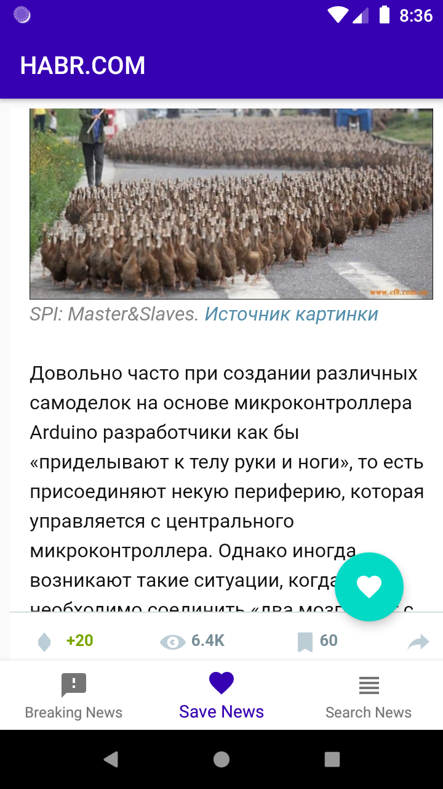

# MVVMNewsApp
## Возможности приложения:  
*  загрузка данных с API https://newsapi.org
*  приложение имеет три fragment, это свежие статьи, сохранненые и поиск статей
*  возможность удалить статью при помощи свайпа вправо или влево
*  при тапе на ячейке списка открывается новый фрагмент с WebView, где можно просмотреть и сохранить статью
## Используемые библиотеки и архитектура:
*  Приложение разработано на языке Kotlin 
*  Retrofit для взаимодействия с REST API сайта
*  Glide для загрузки изображений
*  Room для работы с базой данных 
*  Paging 3 для пагинации данных в RecycleView
*  Coroutines для асинхронной загрузки данных
*  Архитектурный паттерн MVVM
*  ### Скриншоты

